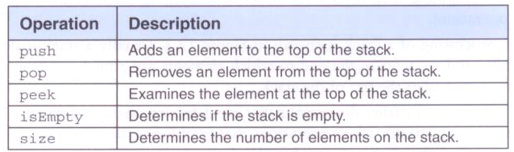

## Getting Started

Welcome to the VS Code Java world. Here is a guideline to help you get started to write Java code in Visual Studio Code.

## Folder Structure

The workspace contains two folders by default, where:

- `src`: the folder to maintain sources
- `lib`: the folder to maintain dependencies

Meanwhile, the compiled output files will be generated in the `bin` folder by default.

> If you want to customize the folder structure, open `.vscode/settings.json` and update the related settings there.

## Dependency Management

The `JAVA PROJECTS` view allows you to manage your dependencies. More details can be found [here](https://github.com/microsoft/vscode-java-dependency#manage-dependencies).

## Implemented Data Structures

1. Tree (Binary Search Tree / AVL Tree) – Organize vehicles by mileage or type for efficient sorted traversal and range queries.

2. Hash Table (Manual HashMap) – Store and retrieve vehicles by registration number or type with constant-time access.

3. Stack – Manage available drivers in LIFO order, ideal for assigning the most recently available driver.

4. Queue – Assign drivers or process deliveries in FIFO order, simulating real-world dispatching.

5. LinkedList – Track delivery records with dynamic insertion/removal for rerouting and status updates.

6. Min-Heap / Priority Queue – Schedule vehicle maintenance by urgency (based on mileage or last service date), ensuring high-priority servicing.

7. Nested Map (Map<String, Map<String, Object>>) – Store detailed maintenance records per vehicle, including parts replaced and associated costs.

8. Array / List – Hold collections of vehicles, drivers, or deliveries for sorting and batch operations.

9. Binary Search – Quickly locate vehicles by registration number in a sorted array or list.

10. Insertion Sort – Sort small datasets like driver names manually with stable performance.

11. Merge Sort – Efficiently sort vehicles by mileage with guaranteed O(n log n) performance.

12. Quick Sort – Sort fuel usage or delivery ETA with fast average-case performance and in-place partitioning.

## Stack usage

To use stack declare a new object
        CustomStack<E> stackname = new CustomStack<>(); and add the import (import CustomDataStructures.CustomStack;)
You can now call the elements using their method definitions
        stackname.clear(); - pop out all elements.
        stackname.isEmpty(); - boolean to check if stack is empty.
        stackname.peek(); - check the last element.
        stackname.pop(); - remove the last element.
        stackname.push(element); - add new element.
        stackname.size(); - check the stack size.
